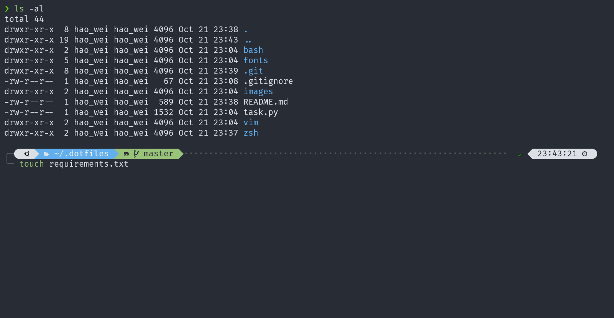
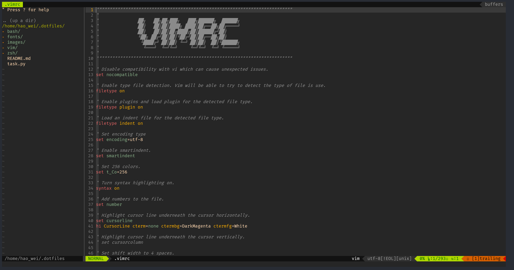
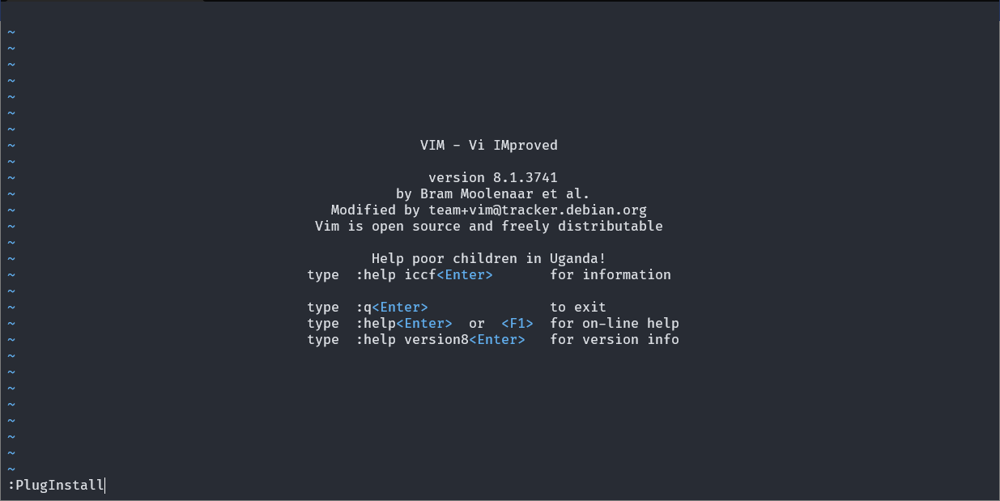
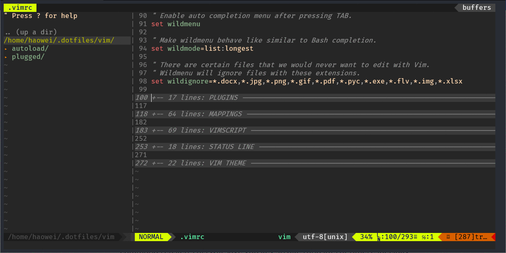

# Alva's dotfile

## Getting Started

### Prerequisites

1. Clone this repo to `$HOME`:

    ```sh
    cd
    git clone git@github.com:alva-fu/dotfile.git
    cd dotfiles
    ```

2. Install the [`invoke`](https://www.pyinvoke.org/) module with `pip`:

    ```sh
    pip install invoke
    ```

    **Note:** [Python](https://www.python.org/) should be installed before installing invoke.

### Zsh



#### Zsh Installation

1. Install the following packages first:

   - Zsh

       ```sh
       sudo apt update
       sudo apt install zsh
       sudo usermod -s $(which zsh) $(whoami)
       ```

       **Note:** Please restart terminal after installing `zsh`.

   - `curl` or `wget`

       ```sh
       sudo apt update && sudo apt install curl
       sudo apt update && sudo apt install wget
       ```

   - `git`

2. Run the following commands:

    - Install [**Oh My Zsh**](https://github.com/ohmyzsh/ohmyzsh):

        ```sh
        cd $HOME/.dotfiles/
        invoke BuildZsh
        ```

    - Plugins (include [`zsh-autosuggestions`](https://github.com/zsh-users/zsh-autosuggestions), [`zsh-completions`](https://github.com/zsh-users/zsh-completions) and [`zsh-highlighting`](https://github.com/zsh-users/zsh-syntax-highlighting)) and theme could also be installed at the same time:

        ```sh
        invoke BuildZsh -p -t
        ```

3. Install the **fonts**:

    - Download and install the [Nerd Fonts](https://www.nerdfonts.com/).

4. Replace the original `$HOME/.zshrc` and `$HOME/.zprofile`  with `$HOME/dotfiles/zsh/.zshrc` and `$HOME/dotfiles/zsh/.zprofile`.

    ```sh
    invoke MakeSoftlink -p -z
    ```

### Vim



#### Vim Installation

1. Install the following packages first:

   - Vim:

        ```sh
        sudo apt install vim
        ```

   - `vim-plug`:

        ```sh
        curl -fLo ~/.vim/autoload/plug.vim --create-dirs \
            https://raw.githubusercontent.com/junegunn/vim-plug/master/plug.vim
        ```

2. Open up **Vim** and type `:PlugInstall` to download and install the plugins.



#### Vim Usage

1. Move the cursor on fold lines and press:
    - `zo` to open a single fold under the cursor.
    - `zc` to close the fold under the cursor.
    - `zR` to open all folds.
    - `zM` to close all folds.


